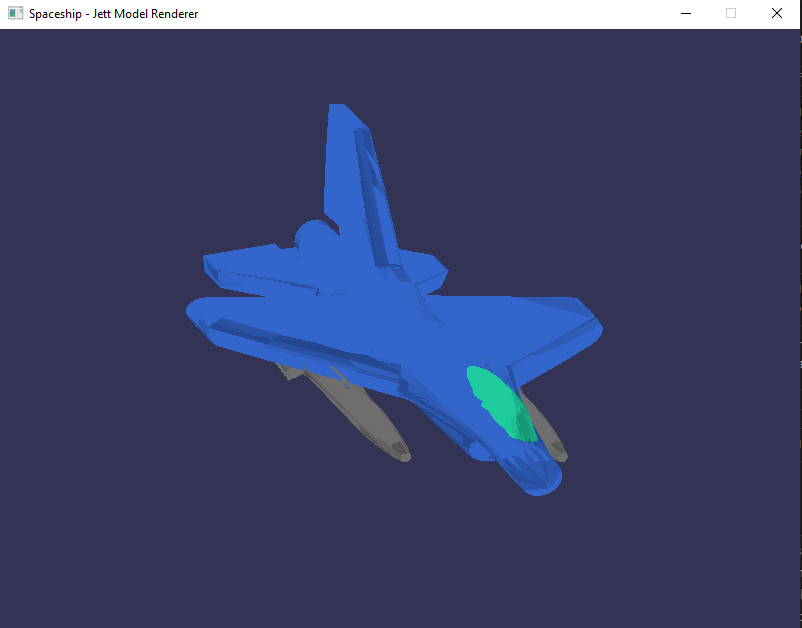
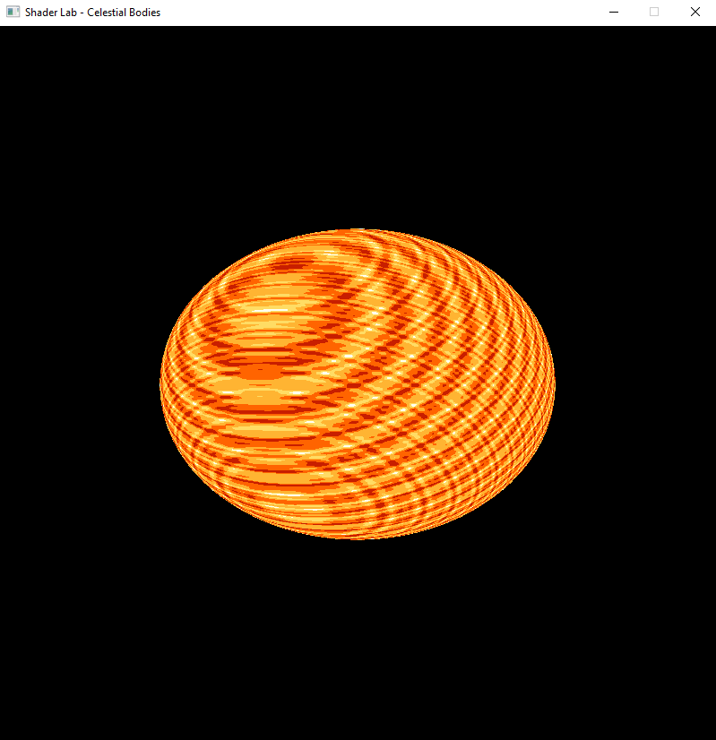
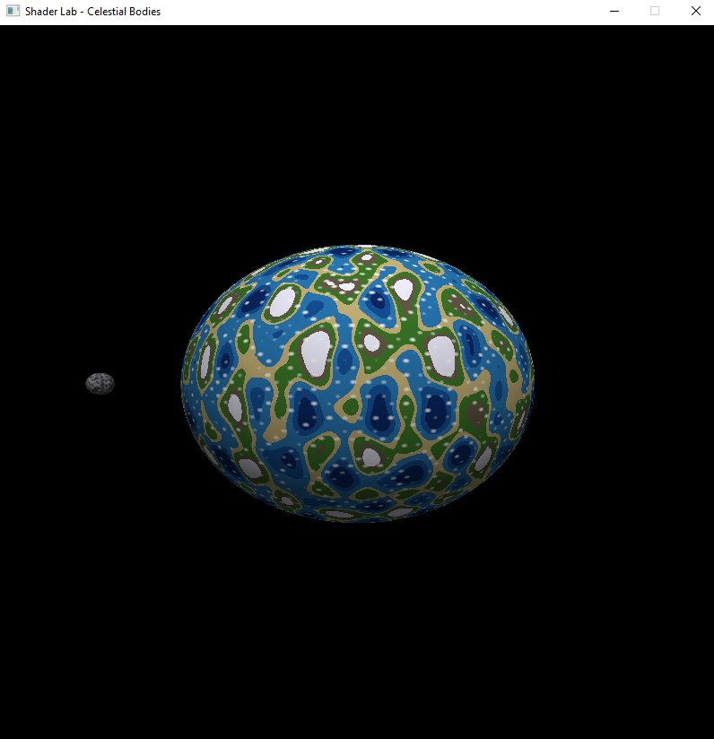
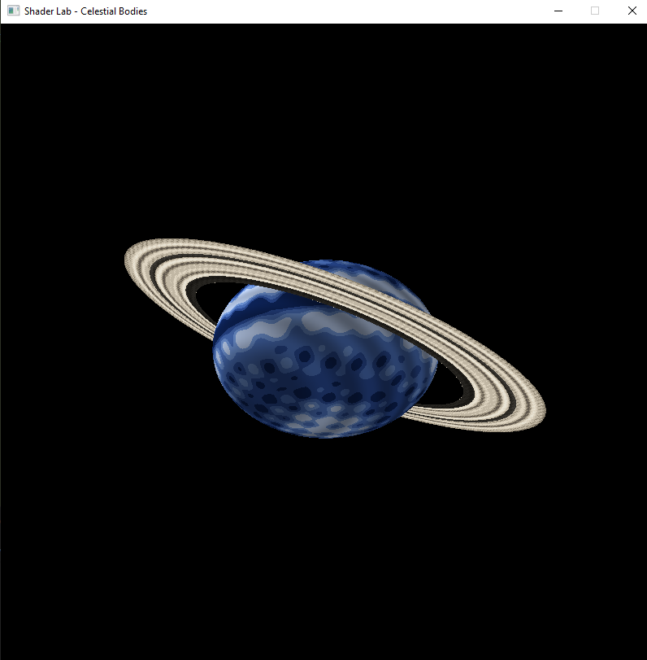
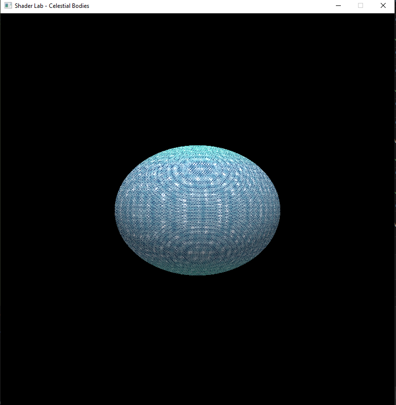
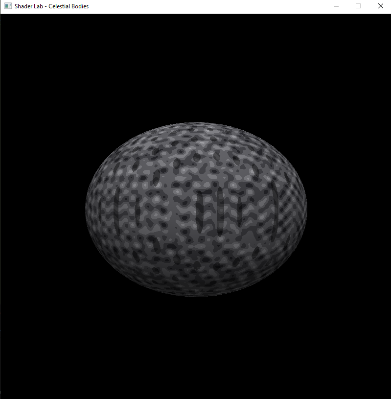

# Proyecto 3: Sistema Solar - Software Renderer

## Descripción del Proyecto

Este proyecto consiste en la creación de un sistema solar interactivo utilizando un software renderer desarrollado desde cero en Rust. El proyecto utiliza técnicas de renderizado 3D, iluminación procedural con shaders, y carga de modelos OBJ para crear una experiencia visual inmersiva.

---

## 🚀 Fase 1: Nave Espacial ✅ 

Se ha modelado y renderizado una nave espacial personalizada (Jett) que servirá como cámara móvil para explorar el sistema solar.



**Características de la nave:**
- Modelo 3D personalizado creado en Blender
- Múltiples materiales y colores:
  - Cuerpo azul metálico
  - Cabina celeste translúcida
  - Misiles/armas gris oscuro
- Sistema de iluminación bidireccional con múltiples fuentes de luz
- Carga de archivos OBJ con materiales MTL

---

## 🌌 Fase 2: Laboratorio de Shaders ✅ 
Se han implementado **5 cuerpos celestes** utilizando shaders procedurales (sin texturas), cada uno con características únicas y múltiples capas de efectos.

### ☀️ **1. Estrella**



**Características:**
- **3 capas de ruido** superpuestas para crear superficie solar dinámica
- **5 niveles de color:** Núcleo blanco → Amarillo brillante → Amarillo → Naranja → Rojo profundo
- **Animación:** Ondas de plasma en movimiento constante

---

### 🌍 **2. Planeta Terrestre con Luna**



**Características del Planeta:**
- **4 capas procedurales:**
  1. Continentes (ruido base)
  2. Océanos profundos
  3. Vegetación (transición tierra-mar)
  4. Nubes dinámicas semi-transparentes
- **6 niveles de color:** Océano profundo → Mar → Costa → Tierra → Montañas → Nieve
- **Mezcla de nubes** con superficie para efecto atmosférico
- **Iluminación:** Reflejo especular en océanos

**Luna Orbitando:**
- Esfera más pequeña con shader rocoso gris
- Cráteres procedurales con sombras
- **Órbita circular** alrededor del planeta
- Rotación independiente

---

### 🪐 **3. Gigante Gaseoso con Anillos**



**Características del Planeta:**
- **4 capas atmosféricas:**
  1. Bandas horizontales principales
  2. Turbulencia de segunda capa
  3. **Gran Mancha Roja** (tormenta circular)
  4. Remolinos y vórtices
- **5 tonos de azul:** Azul profundo → Medio → Claro → Muy claro → Blanco
- **Iluminación:** Gradiente atmosférico realista

**Sistema de Anillos:**
- **4 capas de anillos:**
  1. Bandas principales
  2. Bandas secundarias
  3. Partículas individuales
  4. Variación de densidad
- **División de Cassini:** Gaps oscuros entre anillos
- **Inclinación:** 30° para mejor visualización
- Anillo como modelo separado del planeta

---

### ❄️ **4. Planeta Helado**



**Características:**
- **5 capas procedurales:**
  1. Cristales de hielo hexagonales (patrón complejo)
  2. Grietas congeladas oscuras
  3. Escarcha con remolinos
  4. **Auroras polares** (efecto cyan-verde en los polos) 🌟
  5. Niebla atmosférica helada
- **6 niveles de color:** Hielo profundo → Cyan oscuro → Cyan → Cyan claro → Blanco azulado → Blanco puro
- **Efectos especiales:**
  - Reflexión de hielo (brillo aumentado en zonas claras)
  - Auroras boreales/australes visibles
  - Fisuras profundas con sombras

---

### 🌙 **5. Luna**



**Características:**
- **4 capas de ruido** para textura lunar realista
- **Cráteres procedurales** con profundidad
- **5 tonos de gris:** Gris oscuro → Gris medio → Gris → Gris claro → Blanco (rayos de cráteres)
- **Iluminación:** Sombras direccionales en cráteres
- Vista dedicada con mayor escala para apreciar detalles

---


## 🎮 Controles del Laboratorio de Shaders

### Cambio de Cuerpos Celestes:
- **1**: ☀️ Sol / Estrella
- **2**: 🌍 Planeta Terrestre + Luna orbitando
- **3**: 🪐 Gigante Gaseoso + Anillos
- **4**: ❄️ Planeta Helado (con auroras polares)
- **5**: 🌙 Luna (vista dedicada)

### Controles de Cámara:
- **W/A/S/D**: Mover cámara horizontal
- **Q/E**: Mover cámara vertical
- **Mouse + Arrastre**: Rotar objeto
- **ESPACIO**: Activar/desactivar rotación automática
- **ESC**: Salir

---

## 🛠️ Tecnologías Utilizadas

- **Lenguaje**: Rust (2021 edition)
- **Matemáticas**: nalgebra-glm (vectores, matrices)
- **Ventanas**: minifb (framebuffer rendering)
- **Modelado 3D**: Blender
- **Shaders**: Procedurales (ruido Perlin, ruido simplex)

---

## 📁 Estructura del Proyecto

```
spaceship/
├── src/
│   ├── main.rs                   # Loop principal y control de escena
│   ├── framebuffer.rs            # Buffer de píxeles
│   ├── triangle.rs               # Rasterización de triángulos
│   ├── vertex.rs                 # Estructura de vértices
│   ├── obj.rs                    # Carga de modelos OBJ/MTL
│   ├── color.rs                  # Sistema de colores RGB
│   ├── fragment.rs               # Fragmentos para rasterización
│   ├── shaders.rs                # Vertex shader (transformaciones)
│   ├── fragment_shader.rs        # Fragment shaders procedurales
│   ├── sphere.rs                 # Generación de esfera UV
│   └── ring.rs                   # Generación de anillos
├── assets/
│   ├── Jett.obj                  # Modelo 3D de la nave
│   ├── Jett.mtl                  # Materiales de la nave
│   ├── spaceship_image.png       # Screenshot de la nave
│   ├── estrella.png              # Screenshot del sol
│   ├── tierra_con_luna.png       # Screenshot planeta terrestre + luna
│   ├── gaseoso_con_anillos.png   # Screenshot gigante gaseoso + anillos
│   ├── helado.png                # Screenshot planeta helado
│   └── luna_rocosa.png           # Screenshot de la luna
└── Cargo.toml                    # Dependencias
```

---

## 🚀 Instalación y Ejecución

### Requisitos
- Rust 1.70 o superior
- Cargo

### Compilar y Ejecutar
```bash
# Clonar el repositorio
git clone [tu-repositorio]
cd Proyecto3_Spaceship/spaceship

# Compilar y ejecutar en modo release (más rápido)
cargo run --release
```

---

## 📈 Progreso del Proyecto

### ✅ Fase 1: Nave Espacial (Completada)
- [x] Modelado en Blender
- [x] Exportación OBJ/MTL
- [x] Sistema de materiales múltiples
- [x] Iluminación bidireccional
- [x] Controles de cámara básicos

### ✅ Fase 2: Shaders Procedurales (Completada)
- [x] Sol con animación de plasma
- [x] Planeta terrestre con océanos y nubes
- [x] Luna orbitando planeta
- [x] Gigante gaseoso con tormenta
- [x] Sistema de anillos procedurales
- [x] Planeta helado con auroras
- [x] Vista dedicada de luna

### 🔄 Fase 3: Sistema Solar Completo (En Progreso)
- [ ] Múltiples planetas en órbitas simultáneas
- [ ] Plano eclíptico
- [ ] Traslación y rotación planetaria sincronizada
- [ ] Cámara libre en el sistema

### 📅 Fase 4: Navegación Avanzada (Pendiente)
- [ ] Movimiento 3D de cámara 
- [ ] Instant warping entre planetas 
- [ ] Efecto de warp animado 
- [ ] Nave siguiendo la cámara 

### 📅 Fase 5: Extras (Pendiente)
- [ ] Skybox con estrellas 
- [ ] Detección de colisiones 
- [ ] Renderizado de órbitas

---

## 🎨 Detalles Técnicos de los Shaders

### Técnicas Implementadas:
1. **Ruido Procedural:** Perlin/Simplex para texturas orgánicas
2. **Noise Layering:** Múltiples octavas de ruido superpuestas
3. **Color Gradients:** Interpolación suave entre 5-6 colores
4. **Iluminación Lambertiana:** Producto punto entre normal y luz
5. **Mezcla Atmosférica:** Blend de capas con transparencia
6. **Animación Temporal:** Shaders que evolucionan con el tiempo
7. **Efectos Geométricos:** Cráteres, bandas, auroras polares
8. **Modelo Separado:** Anillos como geometría independiente

### Optimizaciones:
- Generación de esfera con LOD ajustable (rings/sectors)
- Cálculo de normales en tiempo real
- Fragment shading eficiente
- Buffer de profundidad (Z-buffer)

---

## 👨‍💻 Autor

**Fernando Rueda - 23748**  
Universidad del Valle de Guatemala  
Curso: Gráficas por Computadora  
Semestre: Sexto (2025)

---

## 🎥 Video Demostración

_[Video pendiente - Próxima entrega]_

---

## 📝 Notas

- **Sin texturas:** Todos los planetas usan shaders 100% procedurales
- **Sin bibliotecas de ruido:** Implementación propia de funciones de ruido
- **Modelos separados:** Luna y anillos son geometría independiente
- **Rotación opcional:** Ya implementada para demostración

---

**Última actualización:** Noviembre 2025  
**Estado:** Fase 2 completada 
