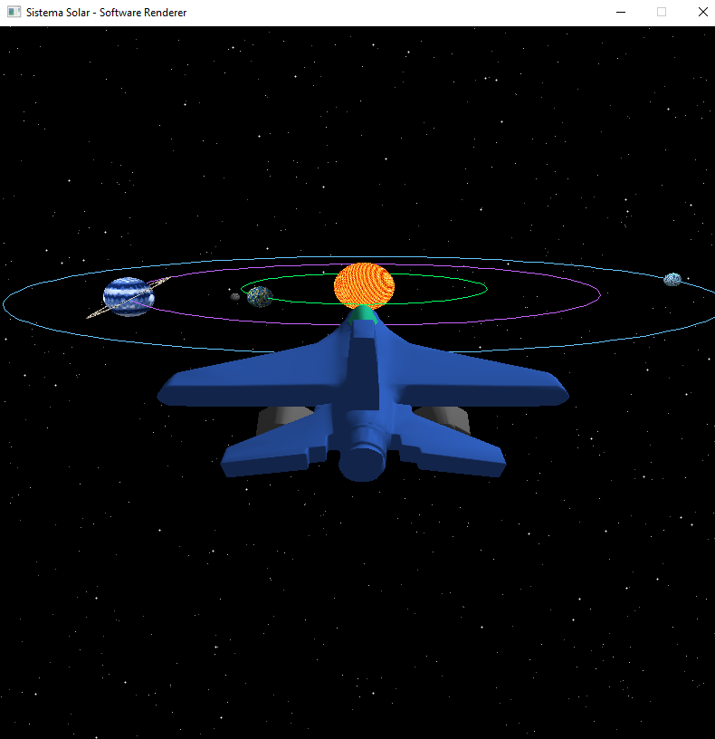

# Proyecto 3: Sistema Solar - Software Renderer

## Descripción del Proyecto

Este proyecto consiste en la creación de un sistema solar interactivo utilizando un software renderer desarrollado desde cero en Rust. El proyecto utiliza técnicas de renderizado 3D, iluminación procedural con shaders, carga de modelos OBJ, y física de colisiones para crear una experiencia visual inmersiva donde puedes explorar un sistema solar completo pilotando una nave espacial.

[](https://youtu.be/jsb2be_Xtjo)

**[▶️ Ver video de demostración en YouTube](https://youtu.be/jsb2be_Xtjo)**

---

## 🎯 Características Principales del Proyecto Final

El proyecto incluye todas las fases completadas:

✅ **Sistema Solar completo con órbitas** 
- Sol central con shader animado
- 3 planetas con órbitas circulares en el plano eclíptico
- 1 luna orbitando el planeta terrestre
- Rotación y traslación planetaria realista
- Sistema de anillos en el gigante gaseoso

✅ **Nave espacial pilotable** 
- Modelo 3D personalizado con múltiples materiales
- Cámara en tercera persona siguiendo la nave
- Controles de vuelo completos (WASD, flechas, Q/E)

✅ **Visualización de órbitas** 
- Trayectorias orbitales visibles con colores distintivos
- Toggle on/off con tecla O

✅ **Skybox con estrellas** 
- 800 estrellas procedurales en el fondo
- Diferentes tamaños y brillos

✅ **Sistema de colisiones físicas** 
- Detección de colisiones entre nave y cuerpos celestes
- Física que previene atravesar objetos
- Feedback visual con bordes rojos

✅ **Shaders procedurales avanzados** 
- 5 shaders únicos con 4-5 capas cada uno
- Sin uso de texturas, todo procedural
- Efectos especiales: auroras, tormentas, nubes, grietas

---

## 🎮 Controles del Sistema Solar

### Controles de Vuelo de la Nave:
- **W**: Avanzar
- **S**: Retroceder
- **A**: Rotar izquierda
- **D**: Rotar derecha
- **Flecha Arriba**: Inclinar hacia arriba
- **Flecha Abajo**: Inclinar hacia abajo
- **Q**: Subir verticalmente
- **E**: Bajar verticalmente

### Controles del Sistema:
- **ESPACIO**: Pausar/Reanudar órbitas planetarias
- **O**: Mostrar/Ocultar trayectorias orbitales
- **ESC**: Salir del programa

---

## 🚀 Fase 1: Nave Espacial ✅ 


**Características de la nave:**
- Modelo 3D personalizado "Jett" creado en Blender
- Múltiples materiales:
  - Cuerpo azul metálico
  - Cabina celeste translúcida
  - Misiles/armas gris oscuro
- Sistema de iluminación bidireccional
- Carga de archivos OBJ con materiales MTL
- Cámara en tercera persona que sigue a la nave

---

## 🌌 Fase 2: Laboratorio de Shaders ✅ 

Se han implementado **5 cuerpos celestes** utilizando shaders procedurales (sin texturas), cada uno con características únicas y múltiples capas de efectos.

### ☀️ **1. Sol / Estrella** (40 pts)


**Características:**
- **3 capas de ruido** superpuestas para crear superficie solar dinámica
- **5 niveles de color:** Núcleo blanco → Amarillo brillante → Amarillo → Naranja → Rojo profundo
- **Animación:** Ondas de plasma en movimiento constante
- **Zoom:** Detalles de alta frecuencia (100x)

---

### 🌍 **2. Planeta Terrestre con Luna** (20 pts por luna orbitando)


**Características del Planeta:**
- **4 capas procedurales:**
  1. Continentes (ruido base)
  2. Océanos profundos
  3. Vegetación (transición tierra-mar)
  4. Nubes dinámicas semi-transparentes
- **6 niveles de color:** Océano profundo → Mar → Costa → Tierra → Montañas → Nieve
- **Mezcla de nubes** con superficie para efecto atmosférico
- **Iluminación:** Reflejo especular en océanos

**Luna Orbitando (+20 pts):**
- Esfera más pequeña con shader rocoso gris
- Cráteres procedurales con sombras
- **Órbita circular** alrededor del planeta
- Rotación independiente
- Sistema de órbita relativa al planeta padre

---

### 🪐 **3. Gigante Gaseoso con Anillos** (20 pts por anillos)


**Características del Planeta:**
- **4 capas atmosféricas:**
  1. Bandas horizontales principales
  2. Turbulencia de segunda capa
  3. **Gran Mancha Roja** (tormenta circular tipo Júpiter)
  4. Remolinos y vórtices
- **5 tonos de azul:** Azul profundo → Medio → Claro → Muy claro → Blanco
- **Iluminación:** Gradiente atmosférico realista

**Sistema de Anillos (+20 pts):**
- **4 capas de anillos:**
  1. Bandas principales
  2. Bandas secundarias
  3. Partículas individuales
  4. Variación de densidad
- **División de Cassini:** Gaps oscuros entre anillos (efecto realista)
- **Inclinación:** 30° para mejor visualización
- Anillo como modelo separado del planeta (geometría independiente)

---

### ❄️ **4. Planeta Helado** (10 pts - planeta extra)


**Características:**
- **5 capas procedurales:**
  1. Cristales de hielo hexagonales (patrón complejo)
  2. Grietas congeladas oscuras
  3. Escarcha con remolinos
  4. **Auroras polares** (efecto cyan-verde en los polos) 🌟
  5. Niebla atmosférica helada
- **6 niveles de color:** Hielo profundo → Cyan oscuro → Cyan → Cyan claro → Blanco azulado → Blanco puro
- **Efectos especiales:**
  - Reflexión de hielo (brillo aumentado en zonas claras)
  - Auroras boreales/australes visibles cerca de los polos
  - Fisuras profundas con sombras
- Planeta extra más allá de los 3 requeridos

---

### 🌙 **5. Luna Rocosa**


**Características:**
- **4 capas de ruido** para textura lunar realista
- **Cráteres procedurales** con profundidad variable
- **5 tonos de gris:** Gris oscuro → Gris medio → Gris → Gris claro → Blanco (rayos de cráteres)
- **Iluminación:** Sombras direccionales en cráteres
- Textura detallada visible desde cerca

---

## 🌍 Fase 3: Sistema solar completo ✅ 

**Sistema implementado:**
- ☀️ **Sol central** (radio: 2.0, posición fija en origen)
- 🌍 **Planeta Terrestre** (órbita: 8.0 unidades, velocidad: 0.5)
  - 🌙 Luna orbitando a 1.5 unidades
- 🪐 **Gigante Gaseoso** (órbita: 15.0 unidades, velocidad: 0.3)
  - Sistema de anillos inclinados 30°
- ❄️ **Planeta Helado** (órbita: 22.0 unidades, velocidad: 0.2)

**Características del Sistema:**
- Todos los planetas orbitan en el **plano eclíptico** (plano XZ)
- **Órbitas circulares** con velocidades distintas (más lentos cuanto más lejos)
- Cada planeta **rota sobre su propio eje** (eje Y)
- **Traslación orbital** sincronizada con el tiempo
- La luna orbita su planeta mientras el planeta orbita el sol
- Escalas relativas apropiadas entre cuerpos

---

## 🛠️ Tecnologías Utilizadas

- **Lenguaje**: Rust (2021 edition)
- **Matemáticas**: nalgebra-glm (vectores Vec2/Vec3/Vec4, matrices Mat4)
- **Ventanas**: minifb (framebuffer rendering, input handling)
- **Modelado 3D**: Blender 3.0+
- **Shaders**: 100% procedurales (ruido Perlin/Simplex)
- **Carga de modelos**: tobj (OBJ/MTL parser)

---

## 📁 Estructura del Proyecto

```
spaceship/
├── src/
│   ├── main.rs                   # Loop principal, sistema solar, física
│   ├── framebuffer.rs            # Buffer de píxeles con Z-buffer
│   ├── triangle.rs               # Rasterización de triángulos
│   ├── vertex.rs                 # Estructura de vértices con normales
│   ├── obj.rs                    # Carga de modelos OBJ/MTL
│   ├── color.rs                  # Sistema de colores RGB
│   ├── fragment.rs               # Fragmentos para rasterización
│   ├── shaders.rs                # Vertex shader (transformaciones MVP)
│   ├── fragment_shader.rs        # Fragment shaders procedurales
│   ├── sphere.rs                 # Generación procedural de esferas UV
│   ├── ring.rs                   # Generación de anillos (disco)
│   └── skybox.rs                 # Sistema de estrellas de fondo
├── assets/
│   ├── Jett.obj                  # Modelo 3D de la nave
│   ├── Jett.mtl                  # Materiales de la nave
│   ├── sistema_solar.png         # Screenshot del sistema completo
│   ├── spaceship_image.png       # Screenshot de la nave
│   ├── estrella.png              # Screenshot del sol
│   ├── tierra_con_luna.png       # Screenshot planeta + luna
│   ├── gaseoso_con_anillos.png   # Screenshot gigante gaseoso
│   ├── helado.png                # Screenshot planeta helado
│   └── luna_rocosa.png           # Screenshot de la luna
└── Cargo.toml                    # Dependencias del proyecto
```

---

## 🚀 Instalación y Ejecución

### Requisitos
- Rust 1.70 o superior
- Cargo

### Clonar y Ejecutar
```bash
# Clonar el repositorio
git clone https://github.com/[tu-usuario]/Proyecto3_Spaceship.git
cd Proyecto3_Spaceship/spaceship

# Compilar y ejecutar en modo release (recomendado para mejor rendimiento)
cargo run --release

# O en modo debug (más lento pero con información de depuración)
cargo run
```

---


## 🎨 Detalles Técnicos de los Shaders

### Técnicas Implementadas:
1. **Ruido Procedural:** Implementación propia de Perlin/Simplex para texturas orgánicas
2. **Noise Layering:** Múltiples octavas de ruido superpuestas (3-5 capas por shader)
3. **Color Gradients:** Interpolación suave entre 5-6 colores usando factor de ruido
4. **Iluminación Lambertiana:** Producto punto entre normal y dirección de luz
5. **Mezcla Atmosférica:** Blend de capas con transparencia (nubes, auroras)
6. **Animación Temporal:** Shaders que evolucionan con `uniforms.time`
7. **Efectos Geométricos:** Cráteres, bandas atmosféricas, tormentas, auroras polares
8. **Modelo Separado:** Anillos y luna como geometría independiente

### Optimizaciones de Rendimiento:
- Generación de esfera con LOD ajustable (rings/sectors)
- Cálculo de normales en tiempo real para iluminación smooth
- Fragment shading eficiente con early-exit cuando es posible
- Z-buffer para correcta oclusión de profundidad
- Validaciones en renderizado de órbitas para evitar crashes
- Cooldown en sistema de colisiones para reducir carga

---


## 👨‍💻 Autor

**Fernando Rueda - 23748**  
Universidad del Valle de Guatemala  
Curso: Gráficas por Computadora  
Semestre: Sexto (2025)

---


**Última actualización:** Noviembre 2025  
**Estado:** Proyecto completado ✅  
**Repositorio:** [GitHub](https://github.com/[tu-usuario]/Proyecto3_Spaceship)

---
